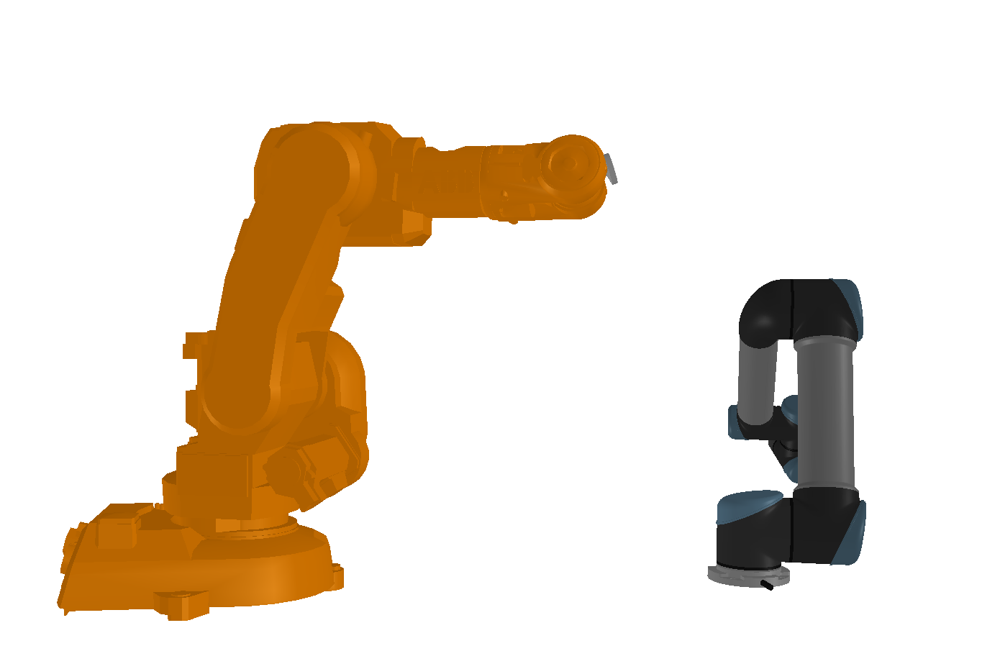

# trimesh.kinematic prototype
--------------

PROTOTYPE for support for rigid body kinematics. I'm not sure if supporting this is something that is feasible or desirable for trimesh, this is just exploring what it might look like. If this improves, it could feasibly live as `trimesh.kinematic`. 

Current state: loads an OpenRAVE XML file and moves a robot around between joint limits using sympy lambdas for forward kinematics.

Challenge: create a data structure which can (mostly) hold and cross-convert **OpenRave XML**, and **URDF**. Ideally would be lossless between the same format for inport and export. 

Also, `trimesh.Scene` objects aren't the greatest thing in the world. Maybe they would need a refactor to support this too?

